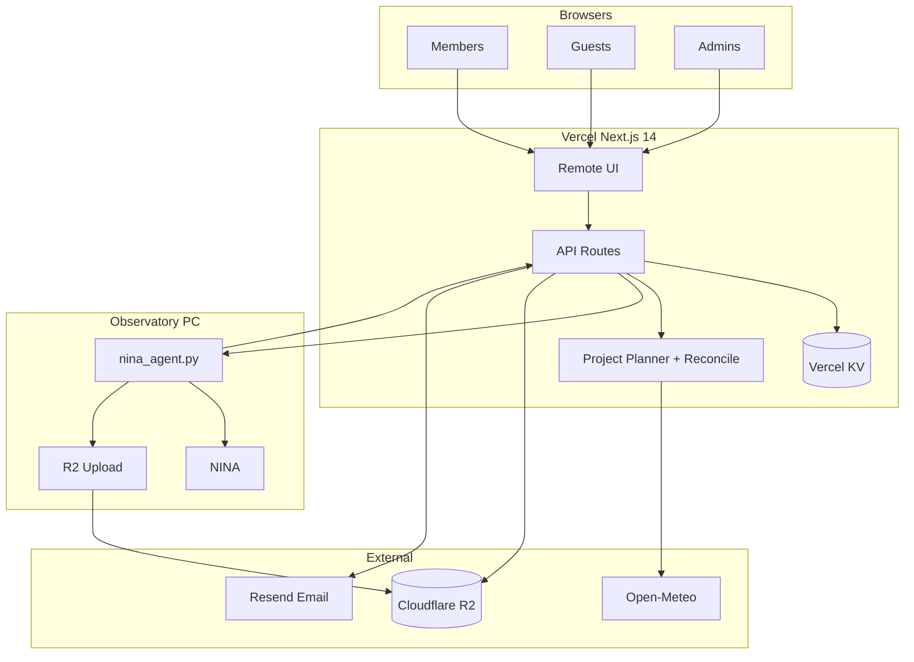

# Pomfret Astro — Complete Platform Guide

**Live site:** [https://www.pomfretastro.org](https://www.pomfretastro.org)

This document is the **single source of truth** for the Pomfret Olmsted Observatory web platform. It is written to serve three roles at once:

1. **Tutorial** — A new member can read from top to bottom and learn how to submit imaging, read the schedule, and retrieve data.
2. **Operator runbook** — The next generation of student operators can run the observatory night, debug failures, and maintain Vercel, KV, and the Windows NINA agent.
3. **Technical record** — Developers and maintainers can see how queueing, scheduling, project mode, weather, NINA delivery, and storage fit together.

The platform is **not** a multi-telescope SaaS. It is a **single observatory** (Pomfret, Connecticut) remote-imaging system: members submit plans on the web; a fair scheduler places them in clear weather; a 24/7 agent on the observatory PC pulls sequences into NINA; data returns via Cloudflare R2.

---

## Table of contents

1. [Quick start (new members)](#1-quick-start-new-members)
2. [What the website is](#2-what-the-website-is)
3. [Dashboard tour](#3-dashboard-tour)
4. [Accounts, roles, and access](#4-accounts-roles-and-access)
5. [Remote imaging — the core workflow](#5-remote-imaging--the-core-workflow)
6. [Tonight’s schedule — how to read it](#6-tonights-schedule--how-to-read-it)
7. [Scheduling engine (weather, altitude, queue)](#7-scheduling-engine-weather-altitude-queue)
8. [Project Mode (multi-night DSO)](#8-project-mode-multi-night-dso)
9. [Variable Star imaging](#9-variable-star-imaging)
10. [Current sessions — statuses and actions](#10-current-sessions--statuses-and-actions)
11. [Email notifications](#11-email-notifications)
12. [Data delivery, preview, and retention](#12-data-delivery-preview-and-retention)
13. [Observatory automation (NINA)](#13-observatory-automation-nina)
14. [Administrator & operator runbook](#14-administrator--operator-runbook)
15. [Night-of operations checklist](#15-night-of-operations-checklist)
16. [Troubleshooting](#16-troubleshooting)
17. [System architecture](#17-system-architecture)
18. [Environment variables](#18-environment-variables)
19. [Development setup](#19-development-setup)
20. [Deployment (Vercel)](#20-deployment-vercel)
21. [Security model](#21-security-model)
22. [HTTP API reference](#22-http-api-reference)
23. [Key source files (`lib/`)](#23-key-source-files-lib)
24. [Repository layout](#24-repository-layout)
25. [Mobile all-sky webapp](#25-mobile-all-sky-webapp)
26. [FAQ](#26-faq)

---

## 1. Quick start (new members)

1. Open [pomfretastro.org](https://www.pomfretastro.org) and go to **Sign up** (or **Dashboard → Account** if the nav shows “Log In”).
2. Create an account with your **Pomfret email**, a username, and a password (≥ 8 characters).
3. Go to **Dashboard → Remote**.
4. Check **Telescope status** is **Ready** (or understand why it is closed).
5. Fill in **New imaging session**: pick **Deep Sky Object** or **Variable Star**, enter target/coordinates, filter plan, and your email.
6. Click **Start Session**. Your row appears under **Current sessions**.
7. Watch **Tonight’s schedule** for your block; when status becomes **IN PROGRESS**, use **Check progress** for the live log and preview.
8. When **COMPLETED**, use **Download file** (no separate session password needed when you are logged in as the submitter).

**Save Session** stores a template on your account; it does **not** submit to the queue. **Run A Saved Session** loads a template into the form.

---

## 2. What the website is

### Public routes

| Route | Purpose |
|-------|---------|
| `/` | Redirects to `/dashboard` |
| `/login` | Standalone login (`?next=` redirect, default `/dashboard`) |
| `/signup` | Registration; default redirect after signup is `/dashboard/remote` |

### Dashboard routes (nav bar)

| Nav label | Route | Purpose |
|-----------|-------|---------|
| *(welcome)* | `/dashboard` | Welcome video — “Welcome To Pomfret Olmsted Observatory” |
| Weather | `/dashboard/weather` | Local forecast, NOAA cloud animation, all-sky camera |
| Atlas | `/dashboard/atlas` | Stellarium sky atlas, telescope FOV overlays, send target to Remote |
| Remote | `/dashboard/remote` | **Main imaging UI** — submit, schedule, monitor, download |
| Gallery | `/dashboard/gallery` | Static showcase images |
| Team | `/dashboard/contact` | Observatory team contact cards |
| Account | `/dashboard/account` | Profile, saved sessions, history; admin tools for admins |
| *(legacy)* | `/dashboard/admin` | Redirects to `/dashboard/account` |
| *(legacy)* | `/dashboard/camera` | Redirects to `/dashboard/weather` |

Guests can browse Weather, Atlas, Gallery, Team, and view much of Remote (schedule, session list, telescope status). **Submitting a session requires a logged-in account.**

---

## 3. Dashboard tour

### Weather (`/dashboard/weather`)

- **Open-Meteo** current conditions for Pomfret, CT (41.9159°N, 71.9626°W): temperature, humidity, cloud cover, wind.
- **NOAA GOES** CONUS cloud animation (proxied via `/api/noaa-goes` to avoid browser CORS issues).
- **All-sky camera** live view (`AllSkyCameraView` component) — same stream family as the mobile webapp.

Use this page to see **macro weather**; the **scheduler** uses its own hourly rules (stricter than “is it cloudy right now?”).

### Atlas (`/dashboard/atlas`)

- Embeds **Stellarium Web Engine** (`public/stellarium/`) with local sky data (`public/skydata/`).
- Overlays telescope **field-of-view** rectangles (TOA 106, SeeStar S30 Pro, Dwarf 3, Dwarf Mini).
- Shows a **tonight schedule ribbon** (twilight bands) aligned with Remote.
- **Object search** resolves catalog names via `/api/imaging/object-resolve`.
- **Send to Remote** navigates to Remote with target and coordinates prefilled.

Atlas is for **planning**; it does not submit to the queue.

### Remote (`/dashboard/remote`)

The operational heart of the site (~4,600 lines of UI). Four regions:

1. **New imaging session** (top left) — submission form.
2. **Tonight’s schedule** (right) — vertical timeline, twilight, weather bands, session blocks.
3. **Current sessions** (bottom left) — queue + board + projects for tonight.
4. **Telescope status** (bottom right) — observatory mode/status + live mount pointing when telemetry is active.

The page polls **current-sessions**, **observatory-status**, **tonight-weather-prediction**, and mount pointing on an interval while open.

### Gallery (`/dashboard/gallery`)

Static image gallery from files in `public/gallery/`. Lightbox viewer.

### Team (`/dashboard/contact`)

Team directory with photos and emails (Director, Operator/Tech, Development).

### Account (`/dashboard/account`)

- **Guest:** inline login/signup panel.
- **Member:** profile, change password, logout, **Saved Sessions**, **Session History**.
- **Admin:** all of the above plus **Observatory Status**, **Log** (audit), **Schedule control** (closed windows), **Session control**, **All Members**.

---

## 4. Accounts, roles, and access

### Registration and login

- **Sign up:** email, username (3–32 chars, `[a-zA-Z0-9._-]`), first/last name, password ≥ 8.
- **Log in:** email **or** username + password.
- Session cookie: `pomfret_session`, httpOnly, ~1 year lifetime, stored server-side in **Vercel KV** (or in-memory in dev without KV).

### Roles

| Role | How you get it | What you can do |
|------|----------------|-----------------|
| **member** | Default on signup | Submit sessions, saved templates, session history, access own runs |
| **admin** | Email listed in `BOOTSTRAP_ADMIN_EMAILS` at signup, or promoted by another admin | All member abilities + observatory controls, audit log, schedule closed windows, force session actions, member directory |

Default bootstrap email if env unset: `qtian.28@pomfret.org` (override in production via Vercel env).

### Session access (progress, preview, download, edit, delete)

For **your own** submissions (matched by `userId` on the session, or legacy email match): **no session password** when logged in.

For **legacy sessions** (created before accounts, or with a session password hash): you may still need the **session password** you chose at submission, or admin access.

**Guests** see Current Sessions but buttons are disabled; they cannot interact.

**Admins** can interact with any session without a password.

### Saved sessions

- Up to **40** named templates per user, stored in KV (`member-saved-sessions:{userId}`).
- API: `/api/member/saved-sessions`.
- Deep link: `/dashboard/remote?savedSessionId={id}`.

### Session history

- API: `/api/member/sessions` — aggregates your queue/board/project rows.
- Shown on Account page.

### Rate limiting (auth)

Login: 20 attempts / 15 min / IP. Signup: 10 / 15 min. Change password: 15 / 15 min. (In-memory per serverless instance — best-effort.)

---

## 5. Remote imaging — the core workflow

You do **not** slew the telescope from the website. You **request** imaging; automation does the rest.

```
Submit form → Queue (pending) → Scheduler (scheduled) → NINA agent pulls sequence
    → IN PROGRESS → Frames on disk → R2 upload → COMPLETED → Download
```

### Session types

| Type | Use for | Project Mode | Filter notes |
|------|---------|--------------|--------------|
| **Deep Sky Object (DSO)** | Galaxies, nebulae, clusters | **Yes** (multi-night) | L, R, G, B, Ha, O, etc. |
| **Variable Star** | Time-series photometry | **No** | **G filter only** (enforced) |

### Output modes (both types)

| Mode | Meaning |
|------|---------|
| **Raw ZIP** | Individual calibrated frames packaged for download |
| **Stacked Master** | Observatory runs Siril stacking (requires **600 s** exposures) |
| **None** | No file delivery (policy / calibration-only runs) |

### Standard DSO session (single night)

1. **Deep Sky Object**, **Project Mode Off**.
2. Target via catalog search or manual RA/Dec.
3. Filter plan: filter name, exposure seconds, frame count per row.
4. **Start Session** (logged in).

The system checks:

- Observatory **Ready** (or offers **queue until ready** if dome is closed — see below).
- Target can fit **altitude ≥ 30°** and **weather** for a proposed slot tonight (for non-project sessions).
- **Fair queue** placement.

### Observatory not ready at submit time

If status is not **Ready**:

- Default: submit is **rejected** with a message.
- Optional UI path: **queue until ready** — session is stored as pending but not scheduled until the observatory opens.

### Project Mode

See [Section 8](#8-project-mode-multi-night-dso). Use when total frames exceed **one clear night**.

### Variable Star

See [Section 9](#9-variable-star-imaging).

### Legacy session password field

When **logged in**, you do **not** need a session password for new submissions. The field may still appear in saved templates for backward compatibility.

---

## 6. Tonight’s schedule — how to read it

Timeline uses **America/New_York**, roughly **4:00 PM → 8:00 AM** across the imaging night.

| Band / label | Meaning |
|--------------|---------|
| Sunset, Civil / Nautical / Astronomical dusk & dawn | When the sky becomes dark enough for work |
| **Weather Permitted** | Forecast hours passing scheduler cloud/precip/wind rules |
| **Weather Not Permitted** | Hours blocked for placement |
| Colored blocks | Scheduled sessions (yours or others’) |
| **Target — Session N** | Project Mode sub-session bars |

Grey or empty regions = scheduler will not place new work there. Block **position and height** = planned start and duration (exposure × frames + ~15 min overhead).

The strip **updates** when you refresh Current sessions or when background reconcile runs.

---

## 7. Scheduling engine (weather, altitude, queue)

Scheduling is **automatic**. You do not pick a start time manually.

### The imaging night

**Tonight** = **nautical dusk** → **nautical dawn** at the observatory (Pomfret, CT). All placement must fit inside this window (`lib/sunrise-window.ts`).

### Weather rules (hourly)

For each forecast hour in the night, Open-Meteo data at (41.9159, -71.9626) must satisfy:

- Cloud cover **< 10%**
- Precipitation probability **< 10%**
- Wind speed **≤ 10 m/s**

**Global hard gate** (whole night): among **remaining** hours (past hours ignored after sunset), the night must have:

- At least **2 consecutive** hours with cloud < 10%
- Not too many windy hours
- No hour with precip probability ≥ 10%

If the global gate fails, **new** scheduling may mark the night blocked (`lib/tonight-weather-gate.ts`).

### Cross-spell placement (important)

Sessions are **not** limited to a single continuous “clear spell” UI window. A run may **span** multiple permitted hour segments as long as **≥ 80%** of the session duration falls in permitted weather and **100%** falls at target altitude ≥ 30° (`lib/imaging-project-planner.ts`, `lib/imaging-queue-schedule-insight.ts`).

Example: if another session ends at 1:36 AM and weather is clear before and after a short gap, the next session may start at **1:36 AM** rather than waiting for the next whole-hour spell boundary.

### Target altitude

Target must stay **≥ 30°** for **100%** of the scheduled exposure interval (checked in 5-minute steps).

### Queue fairness

1. Pending rows ordered by **`createdAt`** (submission time).
2. Scheduler places them one-by-one into free time.
3. Already **scheduled** / **in progress** / **completed** bars occupy time first.
4. **Planned start time** determines who goes first when the telescope is ready — not a separate priority flag.

### Reconcile (recompute schedule)

`reconcilePendingScheduleStatus()` runs when:

- **Current sessions** is loaded (Remote refresh)
- **`nina_agent.py`** hits `/api/imaging/reconcile-queue-schedule` (~every 6 minutes on Hobby plan — no sub-daily Vercel cron)
- Admin changes **schedule control** closed windows

Effects:

- Weather **opens** → you may gain a slot or an extra Project sub-session.
- Weather **closes** → **scheduled** rows may become **unscheduled** or Project subs may split/merge.
- **In progress** runs are **not** torn down by reconcile.

### Single-night vs Project scheduling

| | Single DSO | Project Mode |
|--|------------|--------------|
| Must finish tonight? | Should fit one night | No — totals span nights |
| Queue rows | One | One project row |
| Timeline | One block | One block per sub-session |
| Weather splits | Time may move | **Scheduled** subs can split/merge; **in progress** / **completed** locked |

---

## 8. Project Mode (multi-night DSO)

### Concept

One **project** = one queue entry + `imaging-projects` state in KV. Many **sub-sessions** (`Session 1`, `Session 2`, …) across calendar nights until all filter totals are collected.

### Status levels

| Level | Status | Meaning |
|-------|--------|---------|
| Project | **PENDING** | Submitted; no sub-session tonight yet |
| Project | **IN PROGRESS** | At least one sub scheduled or imaging |
| Project | **COMPLETED** | All frames collected |
| Sub-session | **scheduled** | Planned window tonight (or future) |
| Sub-session | **in_progress** | Currently imaging |
| Sub-session | **completed** | That chunk done; frames count toward total |

### Fair queue with altitude hold

- Project Mode does **not** cut the line.
- While a project is **in progress**, intervals where its target is **≥ 30°** are **reserved** for that project (`lib/imaging-project-altitude-hold.ts`).
- Other members’ sessions fill remaining time (often when the project target is low on the horizon).
- Only **one project** commands the telescope at a time.

### NINA delivery

- **Night 1:** normal queue consume → delivers project night JSON.
- **Night 2+:** queue row already consumed; `GET /api/imaging/nina-sequence` delivers the next **scheduled project sub** by project night id.

### End of night

After the **last** scheduled/active work for the calendar night, the observatory runs **End Night Session** (`End Night Session.json` template) — park, warm, etc. The night does **not** end early just because the project has frames left for future nights.

### Emails (Project)

| Event | Email |
|-------|-------|
| Each sub-session **starts** | Session started |
| **Entire project** all frames done | One completion email (not per sub) |

### Audit reasons

When staff inspect logs, project sub-sessions include `scheduleReasons` in audit entries (weather spans, frame counts, altitude coverage %).

---

## 9. Variable Star imaging

1. Choose **Variable Star Imaging** on Remote.
2. Pick star from catalog / SIMBAD lookup (`/api/imaging/variable-stars`, `/api/imaging/variable-star-lookup`).
3. Duration is chosen in **0.5 h blocks** (+ 15 min overhead); minimum observing time enforced.
4. System schedules and executes with **G** filter only.
5. **No Project Mode** for variable stars.

Sequence template: `Variable Star Sequence.json`.

---

## 10. Current sessions — statuses and actions

### Statuses

| Status | Meaning |
|--------|---------|
| **PENDING** | In queue; not on tonight’s schedule (or project has no plan yet) |
| **SCHEDULED** | Has `plannedStartIso` tonight |
| **IN PROGRESS** | Observatory running sequence |
| **COMPLETED** | Success |
| **FAILED** | Aborted / error |

### Actions

| Action | When | Notes |
|--------|------|-------|
| **Check progress** | Most states | Live log SSE; preview SSE when available |
| **Download file** | Data ready | Presigned R2 URL |
| **Edit session** | Pending / scheduled | Recalculates schedule |
| **Delete session** | Usually always | Owner/admin or legacy password |

Project rows: **Check progress** → pick **Session 1**, **Session 2**, …

---

## 11. Email notifications

Provider: **Resend** (`RESEND_API_KEY`, `IMAGING_MAIL_FROM`).

| Event | When |
|-------|------|
| **Session started** | NINA pulls your sequence |
| **Session completed** | Normal session done, or **whole project** done |
| **Session failed** | Failure path triggers notification |

If mail env is missing, sessions still run; audit log records “mail not configured.”

---

## 12. Data delivery, preview, and retention

### Upload path (observatory PC)

1. `nina_agent.py` watches NINA output folder.
2. Zips / uploads frames to **Cloudflare R2** (S3 API).
3. Reports object keys via `POST /api/imaging/session-files`.
4. Uploads latest JPEG preview via `POST /api/imaging/preview`.

### Download path (member)

`GET /api/imaging/download?queueId=...` → presigned R2 URL (owner, admin, or legacy session password).

### Preview

- Stored in KV per `queueId` (`imaging-preview:{id}`) or served from R2 mapping.
- Live updates via SSE (`preview-stream`).

### 48-hour retention

Completed/failed sessions older than **48 hours** are purged from:

- Session board
- R2 objects and preview mappings
- Completed project assets

Triggered by:

- Daily Vercel cron `GET /api/imaging/cleanup-sessions` (05:00 UTC)
- Every `GET /api/imaging/current-sessions`

---

## 13. Observatory automation (NINA)

### Architecture

```
Website (Vercel)                    Observatory PC (Windows)
─────────────────                   ─────────────────────────
POST /api/imaging/queue      →      (members submit)
GET  /api/imaging/nina-sequence ←   nina_agent.py polls every 45s
POST /api/imaging/session-progress ←  NINA Ground Station HTTP
POST /api/imaging/session-files  ←   agent reports R2 keys
POST /api/imaging/preview        ←   agent uploads JPEG
GET  /api/imaging/reconcile...   ←   agent triggers ~every 6 min
```

### `nina_agent.py` (edit on observatory machine)

Key settings at top of file:

| Setting | Purpose |
|---------|---------|
| `SEQUENCE_JSON_URL` | `https://www.pomfretastro.org/api/imaging/nina-sequence` |
| `POLL_SECONDS` | 45 |
| `TOKEN` | Optional `Authorization: Bearer` (only if `IMAGING_QUEUE_SECRET` set on Vercel) |
| `POMFRET_CRON_SECRET` / `RECONCILE_BEARER` | Same as Vercel `CRON_SECRET` for reconcile |
| `JOBS_DIR`, `NINA_INSTALL_DIR`, `NINA_OUTPUT_DIR` | Local paths |
| `R2_*` | Direct upload credentials |
| `SIRIL_*` | Optional stacked master pipeline |

Workflow: poll sequence URL → if JSON changed → launch NINA with sequence file → on completion scan output → upload R2 → report keys → upload preview.

### Sequence JSON templates (repository root)

| File | Use |
|------|-----|
| `Classic DSO Imaging Sequence.json` | Single-filter DSO |
| `Classic DSO Imaging Sequence Multi Filter.json` | Multi-filter DSO |
| `Variable Star Sequence.json` | Variable star |
| `End Night Session.json` | End-of-night park sequence |

Runtime builder: `lib/build-nina-sequence-json.ts` injects coordinates, filter loops, `PomfretAstro.QueueId`, progress HTTP credentials from env.

Bundled into Vercel deploy via `next.config.js` `outputFileTracingIncludes`.

### NINA plugins

| Path | Purpose |
|------|---------|
| `nina-plugins/PomfretAstro.MountTelemetry/` | Posts RA/Dec/alt/az to `/api/imaging/mount-pointing` — shown on Remote telescope panel |
| `nina.plugin.template/` | Scaffold for new NINA plugin development |

### `GET /api/imaging/nina-sequence` delivery rules

- Respects **admin closed windows** (409 with description).
- Requires **observatory ready** for member sessions (end-night sequence bypasses).
- Target **≥ 30°** at delivery time.
- **Project altitude hold:** if active project target ≥ 30°, non-project sessions wait.
- **Consumes** queue row on first delivery; later nights use project night ids.
- Upserts board `in_progress`, sends start email.
- After last tonight work → delivers **End Night** template once per night.

---

## 14. Administrator & operator runbook

### Observatory status (`Account` → admin section)

| Status | Meaning |
|--------|---------|
| **ready** | Accepting work |
| **busy_in_use** | Sequence running, or no nina-sequence poll within **90 s** |
| **closed_weather_not_permitted** | Auto mode: live weather fails gate |
| **closed_daytime** | Sun up (nautical dawn → dusk) |
| **closed_observatory_maintenance** | Admin closed window active |

**Mode:**

- **manual** — admin sets status directly.
- **auto** — status from daytime + weather + busy overlay.

Persisted in KV key `observatory-status`.

### Schedule control (closed windows)

Add intervals (start/end ET, description) when the dome must not take work (maintenance, events). Overlaps with **in progress** sessions are rejected. Adding/removing windows triggers **reconcile**.

### Session control

Force **complete**, **fail**, or **delete** on active sessions (`/api/imaging/session-control`). Use when NINA is stuck or a row is orphaned.

### Audit log

Read-only activity feed: submissions, deliveries, status changes, retention deletes, schedule events.

### Member directory

- **GET/PATCH/DELETE** `/api/admin/members`
- Promote to admin; delete non-admin members (not self, not other admins).

### When to use manual mode

- Open dome for special night despite borderline forecast → **manual ready**.
- Known bad forecast but testing hardware → **manual maintenance** + do not accept member submits.
- After hardware fix → return to **auto** or **manual ready**.

---

## 15. Night-of operations checklist

### Before sunset

- [ ] Observatory PC on; `nina_agent.py` running (or scheduled task).
- [ ] NINA installed; sequence templates path matches agent config.
- [ ] Vercel production healthy; KV env vars set.
- [ ] Check `/dashboard/weather` and admin **Observatory Status** (auto mode).
- [ ] Confirm no stray **closed windows** in schedule control.
- [ ] Optional: verify `CRON_SECRET` / agent reconcile token matches Vercel.

### During the night

- [ ] Watch **audit log** for `nina-sequence` deliveries and errors.
- [ ] If agent logs 401 on reconcile → fix `CRON_SECRET` / `POMFRET_CRON_SECRET`.
- [ ] If sessions stuck **scheduled** but never **in progress** → check altitude at delivery, observatory ready, project hold, closed window.
- [ ] Remote **Telescope status** should show mount pointing when telemetry plugin active.

### After dawn

- [ ] Confirm **End Night** sequence ran (audit log).
- [ ] Review **failed** sessions; notify members if needed.
- [ ] 48h retention will purge old completed rows automatically.

### If the site is down

- Members cannot submit; agent may still fail on HTTPS fetch.
- Check Vercel deployment, KV connectivity, env vars.
- Roll back via Vercel dashboard if bad deploy.

---

## 16. Troubleshooting

| Symptom | Likely cause | What to check |
|---------|--------------|---------------|
| Submit rejected “observatory not ready” | Status closed | Observatory panel; weather; closed window |
| Stays **PENDING** with clear weather | Altitude, queue, or gap too short | Schedule reasons in audit; reconcile logs |
| **Scheduled** but never starts | Delivery blocked | Target < 30° at poll time; another project hold; NINA not polling |
| Agent 401 on sequence | `IMAGING_QUEUE_SECRET` set without TOKEN | Align agent `TOKEN` with Vercel secret, or unset secret |
| No emails | Resend not configured | `RESEND_API_KEY`, `IMAGING_MAIL_FROM` |
| Download missing | R2 mapping / retention | `session-files` POST from agent; 48h purge |
| Lost all users after deploy | KV not configured | `KV_REST_API_URL`, `KV_REST_API_TOKEN` on Vercel |
| Project night 2 not delivering | Queue consumed; sub not scheduled | Reconcile; project planner logs; in_progress lock |
| M101 starts at 2 AM after Markarian | Weather spell boundary (if < 80% cross-spell) | Audit `scheduleReasons`; permitted hour gaps |

---

## 17. System architecture



### Data stores (KV keys)

| Key / pattern | Data |
|---------------|------|
| `member-users`, indexes | Accounts |
| `member-session:{token}` | Login sessions |
| `member-saved-sessions:{userId}` | Templates |
| `imaging-queue-requests` | Pending queue |
| `imaging-session-board` | After delivery |
| `imaging-projects` | Multi-night state |
| `observatory-status` | Dome status |
| `admin-closed-windows` | Maintenance intervals |
| `imaging-r2-object-map` | queueId → R2 key |
| `imaging-preview:{queueId}` | Preview JPEG |
| `imaging-audit-log` | Admin log |
| `end-night-state` | End-night flags |

Without KV, stores fall back to **in-memory** (data lost on cold start).

---

## 18. Environment variables

### Required for production persistence

| Variable | Purpose |
|----------|---------|
| `KV_REST_API_URL` | Vercel KV REST endpoint |
| `KV_REST_API_TOKEN` | KV token |

### Member / auth

| Variable | Purpose |
|----------|---------|
| `BOOTSTRAP_ADMIN_EMAILS` | Comma-separated admin emails |
| `NODE_ENV` | `production` → secure cookies |

### Imaging / observatory

| Variable | Purpose |
|----------|---------|
| `IMAGING_QUEUE_SECRET` | Optional Bearer for queue reads / agent uploads; **if unset, open** |
| `CRON_SECRET` | Bearer for cleanup + reconcile crons; **if unset, open** |
| `IMAGING_QUEUE_FILE` | Dev file fallback for queue |
| `OBSERVATORY_STATUS_FILE` | Dev file fallback for status |
| `IMAGING_R2_WRITE_SECRET` | Bearer for direct R2 map POST |

### NINA / agent

| Variable | Purpose |
|----------|---------|
| `NINA_SESSION_PROGRESS_BASIC_PASSWORD` | Progress POST auth (open if unset) |
| `NINA_SESSION_PROGRESS_BASIC_USER` | Basic auth user (default `pomfretastro`) |
| `NINA_SESSION_END_MARKER` | Custom completion line substring |
| `NINA_MOUNT_TELEMETRY_SECRET` | Mount telemetry Bearer |
| `NINA_MOUNT_TELEMETRY_BASIC_*` | Basic auth alternative |

### R2 (Cloudflare)

| Variable | Purpose |
|----------|---------|
| `R2_ENDPOINT`, `R2_BUCKET`, `R2_ACCESS_KEY_ID`, `R2_SECRET_ACCESS_KEY` | S3 API |
| `R2_REGION` | Default `auto` |
| `R2_PRESIGN_TTL_SEC` | Presigned URL TTL (default 300) |
| `R2_SESSION_OBJECT_SUFFIX` | Fallback key suffix |

### Email

| Variable | Purpose |
|----------|---------|
| `RESEND_API_KEY` | Resend API |
| `IMAGING_MAIL_FROM` | From address |

### Mobile webapp

| Variable | Purpose |
|----------|---------|
| `NEXT_PUBLIC_CAMERA_STREAM_URL` | All-sky stream URL |
| `NEXT_PUBLIC_OBSERVATORY_STATUS_URL` | Status API for HUD |

---

## 19. Development setup

### Prerequisites

- Node.js 18+
- npm

### Commands

```bash
npm install
npm run dev          # http://localhost:3000
npm run build
npm run lint
```

### Local persistence

Without KV, all state is **in-memory** — fine for UI work, not for multi-user testing across restarts.

Optional file fallbacks: `IMAGING_QUEUE_FILE`, `OBSERVATORY_STATUS_FILE`.

### Tests (selected)

```bash
npx tsx --test lib/imaging-project-planner.multi-window.test.ts
npx tsx --test lib/imaging-project-altitude-hold.test.ts
npx tsx --test lib/member-store.test.ts
```

---

## 20. Deployment (Vercel)

```bash
npm run deploy    # vercel --prod --yes
```

- **Region:** `iad1` (`vercel.json`)
- **Cron:** `GET /api/imaging/cleanup-sessions` at `0 5 * * *` UTC daily
- **Reconcile:** no Vercel cron (Hobby) — `nina_agent.py` polls reconcile URL

### Production checklist

1. Link Vercel project; set **KV** integration → `KV_REST_API_URL`, `KV_REST_API_TOKEN`.
2. Set `BOOTSTRAP_ADMIN_EMAILS` to staff emails.
3. Set R2 and Resend vars if using download/email.
4. Set `CRON_SECRET`; copy same value to observatory `POMFRET_CRON_SECRET`.
5. Only set `IMAGING_QUEUE_SECRET` if agent `TOKEN` is configured to match.
6. Deploy; verify `/dashboard/remote` and one test submit.

### `.vercelignore`

Excludes large local build artifacts (`emsdk/`, engine sources) from upload.

---

## 21. Security model

| Layer | Mechanism |
|-------|-----------|
| Passwords | scrypt hashes (`lib/session-password.ts`) |
| Sessions | httpOnly cookie, KV-backed, deleted on logout |
| Submit queue | Requires logged-in member (`requireUser`) |
| Session progress/download | Owner, admin, or legacy session password |
| Auth endpoints | IP rate limits |
| Queue list API | Contact fields redacted; optional Bearer if secret set |
| Current sessions | Contact redacted for guests |
| HTTP headers | `X-Frame-Options`, `X-Content-Type-Options`, `Referrer-Policy`, `Permissions-Policy` |
| CORS | Imaging routes echo allowed first-party origins |

**Not implemented (future hardening):** email verification, password reset flow, route middleware for all dashboard pages, global Redis rate limits.

---

## 22. HTTP API reference

### Auth

| Method | Path | Auth |
|--------|------|------|
| POST | `/api/auth/signup` | Public (rate limited) |
| POST | `/api/auth/login` | Public (rate limited) |
| POST | `/api/auth/logout` | Cookie |
| GET | `/api/auth/me` | Cookie |
| POST | `/api/auth/change-password` | Cookie |

### Member

| Method | Path | Auth |
|--------|------|------|
| GET/POST/DELETE | `/api/member/saved-sessions` | Member |
| GET | `/api/member/sessions` | Member |

### Admin

| Method | Path | Auth |
|--------|------|------|
| GET/PATCH/DELETE | `/api/admin/members` | Admin |

### Imaging (selected)

| Method | Path | Auth / notes |
|--------|------|----------------|
| GET | `/api/imaging/queue` | Pending for NINA; optional Bearer; `?scope=all` member/Bearer |
| POST | `/api/imaging/queue` | Member |
| GET/PATCH/DELETE | `/api/imaging/queue/[id]` | Session auth |
| GET | `/api/imaging/nina-sequence` | Observatory poller (open; delivery rules apply) |
| GET | `/api/imaging/current-sessions` | Public read; contact redacted if guest |
| POST | `/api/imaging/session-progress` | NINA (optional Basic auth env) |
| GET | `/api/imaging/download` | Session auth |
| GET/POST | `/api/imaging/preview` | Session / agent Bearer |
| POST | `/api/imaging/session-files` | Agent Bearer if secret set |
| GET | `/api/imaging/reconcile-queue-schedule` | `CRON_SECRET` Bearer |
| GET | `/api/imaging/cleanup-sessions` | `CRON_SECRET` Bearer |
| GET/PATCH | `/api/imaging/observatory-status` | GET public; PATCH admin |
| GET/POST/DELETE | `/api/imaging/schedule-control` | Admin |
| GET/POST | `/api/imaging/session-control` | Admin |
| GET | `/api/imaging/audit-log` | Admin |
| GET | `/api/imaging/tonight-weather-prediction` | Used by Remote |
| POST | `/api/imaging/mount-pointing` | NINA telemetry secret |
| GET | `/api/imaging/object-resolve` | Atlas / Remote |
| GET | `/api/imaging/variable-stars` | Variable star UI |
| GET | `/api/noaa-goes` | Weather page proxy |

SSE: `/api/imaging/queue/[id]/progress-stream`, `preview-stream`.

---

## 23. Key source files (`lib/`)

| File | Responsibility |
|------|----------------|
| `member-store.ts` | Users, roles, bootstrap admin |
| `member-auth.ts` | Cookie sessions, `requireUser` / `requireAdmin` |
| `member-saved-sessions.ts` | Saved template KV |
| `imaging-queue-store.ts` | Queue CRUD, validation, NINA JSON |
| `imaging-queue-reconcile.ts` | FIFO schedule recompute |
| `imaging-queue-schedule-insight.ts` | Single-session placement |
| `imaging-project-store.ts` | Multi-night projects |
| `imaging-project-planner.ts` | Nightly sub-session plans |
| `imaging-project-altitude-hold.ts` | ≥30° reservation for active project |
| `imaging-session-board.ts` | Post-delivery lifecycle |
| `imaging-session-access.ts` | Authorize progress/download |
| `imaging-session-control.ts` | Admin force actions |
| `build-nina-sequence-json.ts` | Template → sequence |
| `observatory-status-store.ts` | Dome status computation |
| `admin-closed-window-store.ts` | Maintenance windows |
| `tonight-weather-gate.ts` | Hourly forecast rules |
| `schedule-strip.ts` | Timeline bands for UI |
| `sunrise-window.ts` | Nautical dusk/dawn |
| `target-altitude.ts` | Altitude ≥30° math |
| `r2-session-download.ts` | R2 presign + mapping |
| `imaging-preview-store.ts` | Preview storage |
| `imaging-completion-email.ts` | Resend notifications |
| `imaging-audit-log.ts` | Admin activity log |
| `auth-rate-limit.ts` | Login/signup throttling |

---

## 24. Repository layout

```
website/
├── app/                    # Next.js App Router (pages + API)
│   ├── api/auth/           # Member authentication
│   ├── api/admin/          # Member directory
│   ├── api/member/         # Saved sessions, history
│   ├── api/imaging/        # Queue, NINA, R2, observatory
│   └── dashboard/          # UI pages
├── components/             # Shared React (member provider, auth panel, camera)
├── hooks/                  # use-member
├── lib/                    # Server logic (see table above)
├── public/                 # Static assets, stellarium, gallery, team photos
├── nina_agent.py           # Observatory Windows polling agent
├── nina-plugins/           # NINA mount telemetry plugin
├── nina.plugin.template/   # Plugin scaffold
├── mobile-webapp/          # Standalone all-sky + status HUD
├── Classic DSO Imaging Sequence*.json
├── Variable Star Sequence.json
├── End Night Session.json
├── vercel.json             # Region + cleanup cron
└── README.md               # This file
```

---

## 25. Mobile all-sky webapp

Separate small Next.js app in `mobile-webapp/`:

- Single page: all-sky **camera stream** + compass overlay.
- HUD: time, observatory status, cloud/wind/temp/humidity.
- Env: `NEXT_PUBLIC_CAMERA_STREAM_URL`, `NEXT_PUBLIC_OBSERVATORY_STATUS_URL`.
- Deploy independently (`npm run deploy` in that folder).

Purpose: quick phone view of sky conditions — **not** full Remote imaging.

---

## 26. FAQ

**Why was I rejected for “too long for one night”?**  
Normal DSO session. Shorten the plan or enable **Project Mode**.

**Why PENDING with clear weather on the chart?**  
Altitude, queue occupancy, or no window long enough for at least one exposure + overhead.

**Can someone cut in front of me in the queue?**  
Not automatically. Order is by submission time and fair placement.

**Why did one Project block become Session 1 and Session 2?**  
Cloud gap in forecast or reconcile found two viable windows.

**Can two projects run together?**  
No. One project at a time; others use time when its target is below 30°.

**Do I need a session password?**  
Not for new submissions when logged in. Legacy sessions may still need it.

**What if I didn’t set `IMAGING_QUEUE_SECRET`?**  
NINA `nina-sequence` and agent uploads work without Bearer tokens (current production default). Setting the secret later requires configuring agent `TOKEN` to match.

---

## Summary

| Goal | What to do |
|------|------------|
| One night, one target | DSO, Project Mode **Off**, plan fits one night |
| Many nights, many frames | DSO, Project Mode **On** |
| See tonight’s plan | Remote → schedule + Current sessions |
| Watch a run | Check progress (logged in as owner) |
| Get data | Download when **COMPLETED** |
| Run the observatory | `nina_agent.py` + NINA + this runbook §14–15 |
| Maintain the codebase | §17–24, `lib/` table, Vercel KV env |

The platform **schedules fairly**, **uses clear weather efficiently** (including cross-spell runs when rules allow), and **carries multi-night projects** until every requested frame is collected. Members submit clear plans; operators keep the agent and KV healthy; admins govern the dome.

---

*Last updated: May 2026 — reflects member system, cross-spell scheduling, security hardening, and Account UI layout.*
