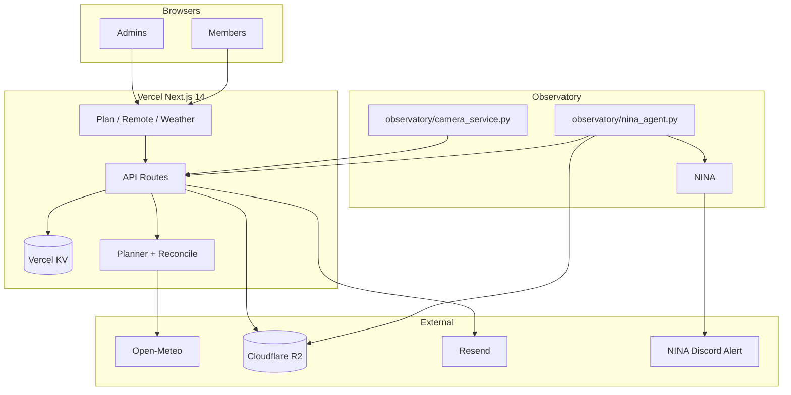

# Pomfret Astro — System Guide

> **v6.1.0** — Scheduling hardening after midnight weather gate, End Night reconcile ordering, and mosaic session labels.

**Live site:** [https://www.pomfretastro.org](https://www.pomfretastro.org)  
**Release:** [v6.1.0](https://github.com/QimingTian/Pomfret-Astro-Website/releases/tag/v6.1.0)

| Part | Who it is for | What it covers |
|------|---------------|----------------|
| **I — User manual** | New members | Every page, button, and status label |
| **II — Operator runbook** | Student operators | Night checklist, admin tools, failures |
| **III — Technical reference** | Developers | Scheduling, architecture, deployment |
| **Appendix** | Developers | HTTP API and route map |

---

## Table of contents

**Part I — User Manual**

1. [Create an account & sign in](#1-create-an-account--sign-in)
2. [Top navigation bar](#2-top-navigation-bar)
3. [Weather page](#3-weather-page)
4. [Plan page (Atlas + Framing)](#4-plan-page-atlas--framing)
5. [Remote page (main imaging UI)](#5-remote-page-main-imaging-ui)
6. [Gallery, Team, Account](#6-gallery-team-account)
7. [Typical member workflow](#7-typical-member-workflow)
8. [Member FAQ](#8-member-faq)

**Part II — Observatory Operator Runbook**

9. [Night-of checklist](#9-night-of-checklist)
10. [Admin tools on Account](#10-admin-tools-on-account)
11. [Troubleshooting](#11-troubleshooting)

**Part III — Technical Reference**

12. [System architecture](#12-system-architecture)
13. [Autonomous scheduler](#13-autonomous-scheduler)
14. [Project Mode, Mosaic & Variable Star](#14-project-mode-mosaic--variable-star)
15. [NINA agent, end night & ESTOP](#15-nina-agent-end-night--estop)
16. [All-sky camera & auto tuning](#16-all-sky-camera--auto-tuning)
17. [Repository layout & `lib/imaging`](#17-repository-layout--libimaging)
18. [Environment variables & deployment](#18-environment-variables--deployment)

**Appendix**

- [HTTP API (selected)](#appendix-http-api-selected)
- [Web routes](#appendix-web-routes)

---

# PART I — User Manual

You **request** imaging on the website; the observatory computer and NINA **execute** it. You do not slew the telescope from the browser.

---

## 1. Create an account & sign in

1. Open [pomfretastro.org](https://www.pomfretastro.org).
2. Click **Log In** (top-right shows your username when signed in).
3. **Sign up** with email, username (3–32 characters), name, and password (≥ 8 characters).
4. After signup you land on **Remote** — that is where you submit sessions.

**Guests** can browse Weather, Plan, Gallery, Team, and view Remote (schedule + session list). **Submitting, editing, progress, and download require a logged-in account.**

---

## 2. Top navigation bar

| Nav button | Page | What you get |
|------------|------|--------------|
| **Pomfret Astro** (logo) | Welcome | Intro video |
| **Weather** | `/dashboard/weather` | Conditions, satellite, radar, moon, all-sky camera |
| **Plan** | `/dashboard/plan` | **Atlas** sky map + **Framing** (NINA-style FOV / mosaic) |
| **Remote** | `/dashboard/remote` | Submit sessions, tonight’s schedule, monitor runs, download |
| **Gallery** | `/dashboard/gallery` | Showcase images |
| **Team** | `/dashboard/contact` | Staff contacts |
| **Log In** / **username** | `/dashboard/account` | Profile, templates, history; admins see extra controls |

---

## 3. Weather page

**What this page tells you:** conditions at Pomfret right now. The **scheduler uses separate hourly rules** (Part III); this page is not the exact robot gate.

| Section | Information |
|---------|-------------|
| **Metric cards** | Temperature, humidity, cloud %, wind / gust (Open-Meteo) |
| **Cloud Map** | NOAA GOES-East CONUS (≈10 min refresh) |
| **Precipitation radar** | LibreWXR past radar + nowcast (proxied) |
| **Moon** | Phase, illumination, altitude, rise/set |
| **All-sky camera** | Live fisheye + ASC overlays (cloud AI, exposure/gain, wind gust, moon illumination, **Thunderstorm Detection** Safe/Unsafe from the shared 20 km ring) |

UI uses unified pill / 1rem corner radius site-wide (v6).

---

## 4. Plan page (Atlas + Framing)

**Plan** replaces the old Atlas-only page. Switch **Atlas | Framing** at the top.

### Atlas mode

Pick a target, inspect FOV overlays, preview tonight’s weather ribbon. Does **not** submit a session by itself.

| Control | What it does |
|---------|--------------|
| **Sky search** | Object name → catalog resolve → center map |
| **Click object** | Name, type, mag, coordinates |
| **Telescope dropdown** | Camera frame for observatory / portable scopes |
| **Layer toggles** | Ground, atmosphere, DSO, DSS, grids |
| **30° altitude ring** | Scheduler minimum altitude |
| **Orbit track** | Selected object tonight |
| **Tonight schedule ribbon** | Same twilight / weather bands as Remote |
| **Send to Remote** | Prefills Remote with name + RA/Dec |

### Framing mode

NINA Framing Assistant–style planning on a **locked** sky:

| Mode | Behavior |
|------|----------|
| **Grid** | Sensor-aligned mosaic (H×V, overlap %). Whole mosaic drags as one; field rotation is rigid |
| **Custom** | Add/drag individual panels; each panel uses parallactic rotation at its sky position |

**v6 framing engine (stable):**

- Idle draw uses Stellarium **VIEW** projection so the yellow box sits on the correct stars for the labeled RA/Dec
- Drag uses screen pixels (smooth); pointer-up commits with a corrected **front-hemisphere** inverse (no antipodal RA flips)
- Frame-center coordinates match NINA for the same on-sky placement

**Send** from Framing carries the mosaic draft into Remote with **Mosaic On** (`?mosaic=1`).

---

## 5. Remote page (main imaging UI)

```
┌─────────────────────────────┬─────────────────────────────┐
│  New Imaging Session        │  Tonight's Schedule         │
│  (submit form)              │  (timeline)                 │
├─────────────────────────────┼─────────────────────────────┤
│  Current Sessions           │  Telescope Status           │
│  (queue + actions)          │  (dome + 3D mount)          │
└─────────────────────────────┴─────────────────────────────┘
```

The page uses **adaptive HTTP polling** (slower by day, faster at night) — not long-lived SSE.

### 5.1 Observatory status

| Label | Meaning |
|-------|---------|
| **Ready** | Accepting new work |
| **Busy -- In Use** | Sequence running (or agent poll stale) |
| **Closed -- Weather Not Permitted** | Auto: forecast fails global weather gate |
| **Closed -- Daytime** | Sun up (nautical dawn → dusk) |
| **Closed -- Observatory Maintenance** | Admin closed window |

If not **Ready**, submit offers **Do not start** or **Queue until ready**.

### 5.2 New Imaging Session

#### Session Type

| Button | Use when |
|--------|----------|
| **Deep Sky Object** | Galaxies / nebulae; LRGBSHO; Project / Mosaic |
| **Variable Star Imaging** | Photometry; **G only**; 0.5 h blocks |

#### Project (DSO) — three-way switch

| Setting | Effect |
|---------|--------|
| **Off** | Single-night session |
| **On** | Multi-night project; one queue row → **Session 1 / 2 / …** until frames done |
| **Mosaic On** | Multi-panel project: each panel has **its own RA/Dec** and **its own filter / exposure / frame plan** |

#### Mosaic On (v6)

1. Import from Plan Framing, or enable Mosaic On and **Add Panel**.
2. Select a panel pill → edit that panel’s coordinates **and** Filters / exposure / counts (label shows `Filters * · Panel N`).
3. Switching panels saves the previous panel’s plan and loads the next.
4. **Add Panel** copies the current panel’s filter plan as a starting point.
5. Submit stores `mosaicPanels` + `mosaicFilterPlansByPanel`. The planner interleaves panels (moon-aware).

#### Target & coordinates

Catalog search (DSO), variable-star catalog / SIMBAD, sexagesimal RA/Dec. Variable star **Tonight** duration buttons: 0.5 h, 1 h, …

#### Filters (DSO)

Filter rows: Luminance, Red, Green, Blue, Sulfur, Hydrogen, Oxygen — count + exposure (s).

#### Output Type

| Button | Delivery |
|--------|----------|
| **Raw ZIP** | Calibrated frames |
| **None** | Run only, no file delivery |

#### Form buttons

| Button | Effect |
|--------|--------|
| **Start Session** | Validate → queue → schedule |
| **Finish Editing** | Resubmit pending/scheduled edit |
| **Save Session** | Template only (does not queue) |
| **Run A Saved Session** | Load template into form |

### 5.3 Tonight's Schedule

Vertical timeline for this imaging night (America/New_York, ≈4 PM → 8 AM): twilight markers, green/red weather bands, session blocks. Headline weather uses **nautical dusk → dawn** only.

### 5.4 Current Sessions

| Status | Meaning |
|--------|---------|
| **Pending** | Not on tonight’s timeline yet |
| **Scheduled** | Planned start tonight |
| **In progress** | Delivered / running |
| **Completed** / **Failed** | Terminal |
| **On hold** | Admin paused |
| **Rejected** | Could not schedule while Ready |

Actions: **Check progress**, **Download file**, **Edit**, **Delete**. Projects: pick **Session N** inside progress for per-sub downloads.

### 5.5 Telescope Status

Observatory status, 3D mount attitude, live RA/Dec/Alt/Az when mount telemetry is fresh.

---

## 6. Gallery, Team, Account

**Gallery** — showcase images; members can submit work from Account.  
**Team** — staff contacts.  
**Account** — profile, saved sessions, history; admins see Part II tools.

---

## 7. Typical member workflow

**Single-night DSO**

1. Plan (Atlas) → target → **Send to Remote**, or search on Remote.
2. Filters + **Raw ZIP** → **Start Session** while **Ready**.
3. Watch schedule → **Check progress** → **Download**.

**Multi-night Project On**

1. Enable **Project On**, enter total frames per filter.
2. Timeline may show **Session 1** tonight; remaining frames continue later nights.

**Mosaic**

1. Plan → Framing → Grid or Custom → **Send**.
2. Remote **Mosaic On**: set each panel’s filters → **Start Session**.

**Variable star**

1. Variable Star Imaging → catalog / SIMBAD → duration → **Start Session** (G only).

---

## 8. Member FAQ

| Question | Answer |
|----------|--------|
| Why “too long for one night”? | Shorten plan or use **Project On** / **Mosaic On**. |
| Why **Pending** with green weather? | Altitude, queue, moon avoidance, or gap too short. |
| Can someone jump the queue? | No — FIFO by `createdAt` + fair placement. |
| Moon blocking LRGB? | Broadband skipped when Moon is too close; try NB or another night. Variable stars ignore moon rules. |
| Mosaic filters the same on every panel? | No (v6) — each panel has its own plan; switch the panel pill to edit. |
| Data retention? | Completed/failed rows and files purge after **48 hours**. |

---

# PART II — Observatory Operator Runbook

## 9. Night-of checklist

**Before sunset**

- [ ] Observatory PC on; `observatory/nina_agent.py` running.
- [ ] NINA + templates match agent config.
- [ ] Vercel prod healthy; KV env set.
- [ ] Account → Observatory Status **Auto** (or deliberate Manual).
- [ ] No stray Schedule Control closed windows.
- [ ] `CRON_SECRET` matches PC `POMFRET_CRON_SECRET`.

**During the night**

- [ ] Audit **Log**: sequence deliveries, ESTOP, schedule changes.
- [ ] Agent 401 → fix bearer token.
- [ ] **Scheduled** but never starts → altitude at delivery, project hold, closed window, NINA not polling.
- [ ] Manual **Emergency STOP** only when the dome must halt now.
- [ ] Weather-safety auto-ESTOP may arm on ASC rain / precip / 20 km thunder (nautical night).

**After dawn**

- [ ] End Night (after sessions and/or dawn) delivered; Discord messages as below.
- [ ] Review **Failed** sessions.

---

## 10. Admin tools on Account

### Observatory Status

**Manual / Auto**; Ready / Busy / Closed pills.

### Emergency STOP

| Phase | Meaning |
|-------|---------|
| **Emergency STOP** | Idle — arm (confirm) |
| **STOPPING…** | Kill/close-dome sequence delivered |
| **STOPPED** | Blocked until dome closed / admin clears |

Arming fails in-progress work, holds pending/scheduled rows, audits who armed it.

### Log / Schedule Control / Session Control

Audit refresh + CSV export; closed windows; Run / Hold / Complete / Fail / Delete / recover In progress.

### All Sky Camera Control / Gallery / Members

Pi modes + auto-tuning charts; gallery moderation; member admin (bootstrap emails can demote other admins).

---

## 11. Troubleshooting

| Symptom | Likely cause | Check |
|---------|--------------|-------|
| Submit “not ready” | Closed status | Obs panel; weather; closed window |
| **Pending** + clear weather | Altitude, moon, queue, gap | Schedule reasons / audit |
| **Scheduled**, never starts | Delivery blocked | ≥30°; project hold; NINA poll |
| Agent 401 | Secret mismatch | `IMAGING_QUEUE_SECRET` / `CRON_SECRET` |
| No download | R2 / retention | `session-files`; 48 h purge |
| Framing RA flipped (e.g. 08h vs 20h) | Pre-v6 inverse bug | Deploy **v6.0.0+** |
| Mosaic filters don’t change per panel | Pre-v6 shared plans | Deploy **v6.0.0+** |
| Weather ESTOP didn’t fire | Daytime / already STOPPED / no threat | Nautical night only; ASC / precip / storm ring |
| ESTOP stuck STOPPING | Agent / KV | Audit `event`; obs PATCH clears STOPPED |

---

# PART III — Technical Reference

## 12. System architecture


```mermaid
flowchart TB
  subgraph users [Browsers]
    M[Members]
    A[Admins]
  end

  subgraph vercel [Vercel Next.js 14]
    UI[Plan / Remote / Weather]
    API[API Routes]
    KV[(Vercel KV)]
    Planner[Planner + Reconcile]
  end

  subgraph obs [Observatory]
    Agent[observatory/nina_agent.py]
    Cam[observatory/camera_service.py]
    NINA[NINA]
  end

  subgraph external [External]
    OM[Open-Meteo]
    R2[(Cloudflare R2)]
    Resend[Resend]
    Discord[NINA Discord Alert]
  end

  M --> UI
  A --> UI
  UI --> API
  API --> KV
  API --> Planner
  Planner --> OM
  Agent --> API
  Cam --> API
  Agent --> NINA
  NINA --> Discord
  Agent --> R2
  API --> R2
  API --> Resend
```

**KV (production):** `member-users`, `member-session:*`, `imaging-queue-requests`, `imaging-session-board`, `imaging-projects`, `observatory-status`, `admin-closed-windows`, `imaging-r2-object-map`, `imaging-preview:{queueId}`, `imaging-audit-log`, `imaging-emergency-stop`, end-night keys, weather-safety debounce, camera auto-tuning history.

Without KV, stores are **in-memory** (lost on cold start).

---

## 13. Autonomous scheduler

**Tonight** = nautical dusk → nautical dawn (Pomfret, CT). Members do not pick start times.

### Weather (`lib/tonight-weather-gate.ts`)

Per hour: cloud **&lt; 10%**, precip **&lt; 10%**, wind **≤ 10 m/s**. Global gate / headline use nautical-night hours only.

### Altitude (`lib/target-altitude.ts`)

Target **≥ 30°** for **100%** of the session window.

### Moon avoidance (`lib/moon-avoidance.ts`)

Lorentzian separation by lunar age (broadband stricter than NB). Normal DSO: all filters must pass. **Project / Mosaic:** skip blocked filters per window. **Variable star:** exempt.

### Queue fairness

FIFO by `createdAt`. In-progress project altitude hold reserves ≥30° intervals. v6 fixes a FIFO double-booking bug that could hide the next Session.

### Reconcile

On current-sessions GET, agent reconcile (~6 min), schedule-control changes. UI polls adaptively (day slow / night faster).

---

## 14. Project Mode, Mosaic & Variable Star

**Project On:** one queue row + `imaging-projects`; subs `{projectId}::night-{n}`.

**Mosaic On:** `mosaicMode` + `mosaicPanels` + per-panel remaining (`mosaicRemainingByPanel` from `mosaicFilterPlansByPanel`). Planner: `planMosaicInterleavedSubSessions` — cross-panel, moon-aware.

**Variable star:** G only; N×0.5 h + 15 min overhead; no Project/Mosaic.

**Auto-hold after failure:** failed sub tonight → new plans that night stay on hold until admin Unhold.

---

## 15. NINA agent, end night & ESTOP

```
Website                              Observatory PC
────────                             ──────────────
POST /api/imaging/queue        →     member submit
GET  /api/imaging/nina-sequence ←    nina_agent.py (~45 s; ESTOP poll faster while imaging)
GET  /api/imaging/emergency-stop/delivery ← ESTOP-only lightweight poll
POST /api/imaging/session-progress ← Ground Station / sequences
POST /api/imaging/session-files  ←   R2 complete
POST /api/imaging/preview        ←   JPEG
GET  /api/imaging/reconcile...   ←   ~6 min
```

**Templates (repo root):** Classic DSO (+ multi-filter), Variable Star, `End Night Session.json`, `EStop.json`. Runtime Discord text patching: `lib/imaging/nina-discord-message.ts`.

### End night

| Trigger | Queue id pattern | Discord |
|---------|------------------|---------|
| After last tonight session | `end-night-{nightKey}` | `Tonight's Session Completed.` |
| Nautical dawn fallback | `end-night-{nightKey}-dawn` | `End Night - Dawn` |

Sequence: Connect → Close dome → Disconnect → Discord.

### Emergency STOP

| Source | Discord |
|--------|---------|
| Manual admin arm | `ESTOPPED` |
| Weather safety (`weather-safety-auto`) | `Weather Safety System Triggered -- Observatory Locked.` |

ESTOP sequence also POSTs dome-closed progress to clear KV state.

**Weather-safety auto-ESTOP** (nautical night only): ASC rain (high confidence), site precip forecast threshold, and/or thunderstorm (`weather_code` 95/96/99) on the **20 km** Open-Meteo ring. Daytime is a no-op. Already STOPPING/STOPPED blocks re-arm. Hooks: agent-pulse, observatory weather refresh, schedule maintenance. Weather **Thunderstorm Detection** uses `GET /api/weather/storm-approach`.

While NINA reports imaging, agent polls deliver **ESTOP only** (409 for other work).

---

## 16. All-sky camera & auto tuning

- Pi `camera_service.py` → MJPEG on Weather + admin.
- Modes: `stream`, `auto`, `half_hour`, `hour`, `off`; gain via `observatory_solar.py` (nautical dawn/dusk).
- ASC cloud/rain AI (`asc_cloud_ai.py`); day/night model sets. Weather Cloud Cover / overlay read ASC status when available.
- Auto exposure / WB samples → `/api/camera/auto-tuning-history`.
- Mount telemetry plugin → Remote 3D panel.

---

## 17. Repository layout & `lib/imaging`

This repository is the **Pomfret Astro website** only (Next.js at repo root). FRAOS editions: [QimingTian/FRAOS](https://github.com/QimingTian/FRAOS).

```
website/                          ← git repo root (= Vercel root)
├── app/                          # Next.js App Router (Weather, Plan, Remote, …)
├── components/                   # Plan framing, Remote, shared UI
├── lib/
│   ├── imaging/                  # queue, project, session, weather-safety, ESTOP, …
│   ├── mosaic/                   # Grid/Custom panel math
│   ├── fov-overlay.ts            # VIEW raDec ↔ screen (v6 front-hemisphere inverse)
│   └── …
├── observatory/                  # nina_agent, camera_service, ASC AI
├── nina-plugins/
├── public/
├── End Night Session.json
├── EStop.json
└── Classic DSO / Variable Star sequence JSON
```

**Tests:** `npm test` · **Types:** `npm run test:types`

---

## 18. Environment variables & deployment

**Required:** `KV_REST_API_URL`, `KV_REST_API_TOKEN`

**Auth:** `BOOTSTRAP_ADMIN_EMAILS`, `SITE_URL`

**Security checklist:** [SECURITY_SETUP.md](SECURITY_SETUP.md)

**Imaging:** `IMAGING_QUEUE_SECRET`, `CRON_SECRET`, `IMAGING_R2_WRITE_SECRET`, R2 S3 vars, NINA progress / mount telemetry secrets

**Optional:** `LIBREWXR_API_BASE_URL`, `RESEND_API_KEY`, `IMAGING_MAIL_FROM`

```bash
npm install && npm run dev    # http://localhost:3000
npm run test:types && npm test
npm run deploy                # Vercel prod (iad1)
```

Cron: `GET /api/imaging/cleanup-sessions` daily 05:00 UTC. Reconcile: agent-driven.

---

# Appendix: HTTP API (selected)

| Method | Path | Notes |
|--------|------|-------|
| POST | `/api/auth/signup`, `/login`, `/logout` | Rate limited |
| GET | `/api/auth/me` | Cookie session |
| POST | `/api/imaging/queue` | Submit (member); mosaic fields optional |
| GET | `/api/imaging/current-sessions` | Public; reconcile + retention |
| GET | `/api/imaging/nina-sequence` | Agent poll |
| GET | `/api/imaging/emergency-stop/delivery` | ESTOP-only poll |
| GET/POST | `/api/imaging/emergency-stop` | Admin status + arm |
| GET | `/api/imaging/reconcile-queue-schedule` | `CRON_SECRET` |
| GET/PATCH | `/api/imaging/observatory-status` | GET public |
| GET/POST/DELETE | `/api/imaging/schedule-control` | Admin |
| GET/POST | `/api/imaging/session-control` | Admin Run / Hold / … |
| GET | `/api/imaging/audit-log` | Admin |
| GET | `/api/imaging/download` | Presigned R2 |
| GET | `/api/imaging/tonight-weather-prediction` | Schedule bands |
| GET | `/api/weather/storm-approach` | 20 km thunder ring |
| GET | `/api/imaging/object-resolve` | Plan / Remote search |
| GET | `/api/imaging/variable-stars`, `/variable-star-lookup` | Variable star UI |
| GET/POST | `/api/camera/auto-tuning-history` | Pi tuning |

Progress/preview use **HTTP polling** (adaptive), not browser SSE.

---

# Appendix: Web routes

| Route | Page |
|-------|------|
| `/dashboard` | Welcome |
| `/dashboard/weather` | Weather + ASC |
| `/dashboard/plan` | **Plan** (Atlas + Framing) |
| `/dashboard/atlas` | Redirect / legacy → Plan |
| `/dashboard/remote` | Main imaging UI |
| `/dashboard/gallery` | Gallery |
| `/dashboard/contact` | Team |
| `/dashboard/account` | Account (+ admin) |
| `/login`, `/signup` | Auth |

---

## What’s new in v6.1.0

- Weather gate uses the **current imaging night** after local midnight (`past_days` + sunset/sunrise pair pick) so FIFO projects can re-schedule post-midnight
- End Night waits for **force reconcile** before deciding the night is empty
- Mosaic `Session P-S` labels no longer bump on every scheduled replan; edit session shows Mosaic On + per-panel plans
- Dashboard welcome story polish; project `onBoard` cleared when fully completed

## What’s new in v6.0.0

- Stable Plan Framing (NINA-aligned VIEW draw + front-hemisphere inverse)
- Mosaic On: **per-panel** filters / exposure / counts
- Weather-safety ESTOP + ASC thunderstorm overlay (20 km ring)
- Distinct Discord messages for end-night (session / dawn) and ESTOP (manual / weather)
- Weather / Remote UI radius polish; project FIFO schedule fix
- Next.js `^14.2.35`; website-only repo at root

Full notes: [Release v6.1.0](https://github.com/QimingTian/Pomfret-Astro-Website/releases/tag/v6.1.0) · [v6.0.0](https://github.com/QimingTian/Pomfret-Astro-Website/releases/tag/v6.0.0)

---

*Last updated: July 2026 — **v6.1.0**. Prior milestones: v6.0.0 Plan/mosaic/weather-safety; v5.x Plan/mosaic/field rotation; v4.x adaptive polling (retire SSE); v3.x Emergency STOP & Session Control; v2.1 moon avoidance.*
