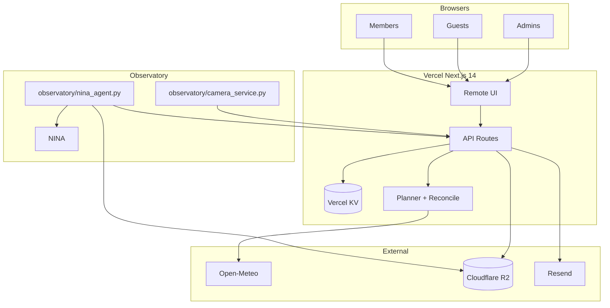

# Pomfret Astro — System Guide

> **Single source of truth** for the Pomfret Olmsted Observatory remote-imaging website.

**Live site:** [https://www.pomfretastro.org](https://www.pomfretastro.org)

| Part | Who it is for | What it covers |
|------|---------------|----------------|
| **I — User manual** | New members | Every page, button, and status label — what to click and what you see |
| **II — Operator runbook** | Student operators | Night checklist, admin tools, common failures |
| **III — Technical reference** | Developers | Scheduling logic, architecture, repo layout, deployment |
| **Appendix** | Developers | HTTP API and route map |

---

## Table of contents

**Part I — User Manual**

1. [Create an account & sign in](#1-create-an-account--sign-in)
2. [Top navigation bar](#2-top-navigation-bar)
3. [Weather page](#3-weather-page)
4. [Atlas page](#4-atlas-page)
5. [Remote page (main imaging UI)](#5-remote-page-main-imaging-ui)
6. [Gallery, Team, Account](#6-gallery-team-account)
7. [Typical member workflow](#7-typical-member-workflow)
8. [Member FAQ](#8-member-faq)

**Part II — Observatory Operator Runbook**

9. [Night-of checklist](#9-night-of-checklist)
10. [Admin tools on Account](#10-admin-tools-on-account)
11. [Troubleshooting](#11-troubleshooting)

**Part III — Technical Reference**

12. [System architecture](#12-system-architecture)
13. [Autonomous scheduler](#13-autonomous-scheduler)
14. [Project Mode & Variable Star](#14-project-mode--variable-star)
15. [NINA agent & observatory scripts](#15-nina-agent--observatory-scripts)
16. [All-sky camera & auto tuning](#16-all-sky-camera--auto-tuning)
17. [Repository layout & `lib/imaging`](#17-repository-layout--libimaging)
18. [Environment variables & deployment](#18-environment-variables--deployment)

**Appendix**

- [HTTP API (selected)](#appendix-http-api-selected)
- [Web routes](#appendix-web-routes)

---

# PART I — User Manual

You **request** imaging on the website; the observatory computer and NINA **execute** it. You do not slew the telescope from the browser.

---

## 1. Create an account & sign in

1. Open [pomfretastro.org](https://www.pomfretastro.org).
2. Click **Log In** (top-right nav shows your username when signed in; before login it says **Log In**).
3. Use **Sign up** with email, username (3–32 characters), name, and password (≥ 8 characters).
4. After signup you land on **Remote** — that is where you submit sessions.

**Guests** can browse Weather, Atlas, Gallery, Team, and view Remote (schedule + session list). **Submitting, editing, progress, and download require a logged-in account.**

---

## 2. Top navigation bar

| Nav button | Page | What you get |
|------------|------|--------------|
| **Pomfret Astro** (logo) | Welcome | Intro video |
| **Weather** | `/dashboard/weather` | Local conditions, satellite cloud map, moon, all-sky camera |
| **Atlas** | `/dashboard/atlas` | Interactive sky map (Stellarium); plan targets and send coordinates to Remote |
| **Remote** | `/dashboard/remote` | **Submit sessions, see tonight’s schedule, monitor runs, download data** |
| **Gallery** | `/dashboard/gallery` | Showcase images from past work |
| **Team** | `/dashboard/contact` | Staff photos and email contacts |
| **Log In** / **your username** | `/dashboard/account` | Profile, saved templates, history; admins see extra controls |

---

## 3. Weather page

**What this page tells you:** “Is it cloudy / windy / humid right now at Pomfret?” — useful for your own planning. The **scheduler uses separate hourly rules** (see Part III); this page is not the exact gate the robot uses.

| Section | Information |
|---------|-------------|
| **Metric cards** | Temperature, apparent temperature, humidity, cloud cover %, wind speed, wind gust (Open-Meteo, Pomfret CT) |
| **Cloud Map** | NOAA GOES-East animated CONUS cloud imagery (auto-refreshes ~every 10 min) |
| **Moon** | Phase photo (NASA), illumination %, altitude, rise/set; drag timeline to see other times |
| **All-sky camera** | Live fisheye view of the observatory sky (same stream family as the mobile webapp) |

---

## 4. Atlas page

**What this page is for:** Pick a target in the sky, see if it fits your telescope’s field of view, and optionally **Send to Remote** with coordinates filled in. Atlas does **not** submit a session by itself.

| Control | What it does |
|---------|--------------|
| **Sky search box** | Type an object name (e.g. `M31`); press Enter — resolves via catalog API and centers the map |
| **Click object on sky** | Selection info panel shows name, type, magnitude, coordinates |
| **Telescope dropdown** | Overlays camera frame for **TOA 106**, **SeeStar S30 Pro**, **Dwarf 3**, or **Dwarf Mini** |
| **Layer toggles** | Ground, atmosphere, deep-sky objects, DSS imagery, azimuthal / equatorial grids |
| **30° altitude ring** | Shows where the scheduler’s minimum target altitude is (same geometry as Remote) |
| **Orbit track** | Solid path of selected object across tonight |
| **Tonight schedule ribbon** | Same twilight / weather bands as Remote (read-only preview) |
| **Send to Remote** | Opens Remote with target name and RA/Dec prefilled |
| **Now** | Reset sky time to current moment |

---

## 5. Remote page (main imaging UI)

Remote is four panels. The page auto-refreshes queue, observatory status, weather prediction, and mount pointing while it stays open.

```
┌─────────────────────────────┬─────────────────────────────┐
│  New Imaging Session        │  Tonight's Schedule         │
│  (submit form)              │  (timeline)                 │
├─────────────────────────────┼─────────────────────────────┤
│  Current Sessions           │  Telescope Status           │
│  (your queue + actions)     │  (dome status + 3D mount)   │
└─────────────────────────────┴─────────────────────────────┘
```

### 5.1 Observatory status line (top of form)

Shows one of:

| Label | Meaning for you |
|-------|-----------------|
| **Ready** | Observatory accepting new work tonight |
| **Busy -- In Use** | A sequence is running (or NINA has not polled recently) |
| **Closed -- Weather Not Permitted** | Auto mode: forecast fails the global weather gate |
| **Closed -- Daytime** | Sun up (between nautical dawn and dusk) |
| **Closed -- Observatory Maintenance** | Admin closed window active |

If you submit while not **Ready**, a modal offers:

1. **Do not start** — cancel submit.
2. **Queue until ready** — session is saved as **Pending**; it will be scheduled when the dome opens (not rejected).

---

### 5.2 New Imaging Session — form fields

#### Session Type (required)

| Button | Use when |
|--------|----------|
| **Deep Sky Object** | Galaxies, nebulae, clusters; LRGBSHO filters; optional **Project Mode** |
| **Variable Star Imaging** | Time-series photometry; **G filter only**; fixed 0.5 h blocks |

#### Project Mode (DSO only)

| Setting | Effect |
|---------|--------|
| **Off** | Single-night session; must fit one clear night (duration + altitude + weather + moon) |
| **On** | Multi-night project; one queue row, many **Session 1 / Session 2 / …** sub-sessions until all frames collected |

#### Target & coordinates

| Field | DSO | Variable Star |
|-------|-----|-----------------|
| **Session Name** | Display name on schedule | Same |
| **Catalog Target Search** | Search NGC/Messier/etc. → fills RA/Dec | — |
| **Star Filter** + **Star List** | — | Filter catalog (Tonight Observable, High Priority, period/type filters) |
| **Search A Star** | — | SIMBAD lookup by name |
| **RA / Dec** | Hours and sexagesimal degrees | Filled from star pick |
| **Tonight** (variable star) | — | Buttons for **0.5 h, 1 h, 1.5 h, …** observing blocks (+ 15 min overhead) |

#### Filters (DSO only)

Add rows with **Filter** (Luminance, Red, Green, Blue, Sulfur, Hydrogen, Oxygen), **Frame Count**, **Exposure per Frame (s)**.

- **Stacked Master** output requires **600 s** exposures on every filter row.

#### Output Type

| Button | What you receive |
|--------|------------------|
| **Raw ZIP** | Calibrated individual frames in a zip |
| **Stacked Master** | Observatory stacks with Siril (600 s exposures only) |
| **None** | Run executes but no file delivery |

#### Camera Temperature

Optional cooling setpoint (°C) passed to NINA sequence.

#### Form buttons

| Button | What it does |
|--------|--------------|
| **Start Session** | Validates form → submits to queue → runs scheduler → row appears under **Current Sessions** |
| **Finish Editing** | Same as Start Session while editing an existing pending/scheduled row |
| **Save Session** | Opens dialog — saves **template only** to your account (does **not** submit) |
| **Run A Saved Session** | Opens dialog — pick a saved template → loads form (still need **Start Session** to submit) |

**Save Session vs Start Session:** Save = bookmark. Start = join the real queue.

---

### 5.3 Tonight's Schedule (right panel)

**What it shows:** A vertical timeline for **this imaging night** (America/New_York, roughly 4 PM → 8 AM).

| Visual | Meaning |
|--------|---------|
| **Sunset → Sunrise** markers | Civil / nautical / astronomical twilight boundaries |
| **Green bands — Weather Permitted** | Hours passing scheduler cloud/precip/wind rules |
| **Red bands — Weather Not Permitted** | Hours blocked for placement |
| **Colored blocks** | Scheduled sessions (height = duration; position = start time) |
| **Target — Session N** | Project Mode sub-session label |
| **Grey / empty** | No schedulable time |

**Headline:** “Tonight’s weather prediction” — **stricter** than the green/red bands (one bad precip hour can mark the whole night “not permitted” in the headline).

Blocks update when you refresh **Current Sessions** or when background reconcile runs (~every 6 min from the observatory agent).

---

### 5.4 Current Sessions (bottom left)

Lists every active queue row, project, and board entry visible tonight.

#### Status badges

| Status | Meaning |
|--------|---------|
| **Pending** | In queue; **not** on tonight’s timeline yet (or project has no plan tonight) |
| **Scheduled** | Has a planned start time tonight |
| **In progress** | NINA is running (or was delivered) |
| **Completed** | Success |
| **Failed** | Aborted or error |
| **Rejected** | Could not schedule while observatory was Ready (e.g. no slot fit) |

#### Row actions

| Button | When it appears | What it does |
|--------|-----------------|--------------|
| **Check progress** | Most statuses | Opens **Session progress** overlay: live terminal log + latest preview JPEG |
| **Download file** | **Completed** and data ready (`outputMode` not None) | Opens presigned download (ZIP or stacked master) |
| **Edit session** | **Pending** or **Scheduled** | Loads form; **Finish Editing** resubmits and recalculates schedule |
| **Delete session** | Usually always (owner/admin) | Removes queue row; may ask session password on legacy rows |

**Project Mode rows:** **Check progress** → pick **Session 1**, **Session 2**, … Each completed sub-session can have its own **Download** inside the progress overlay. Project downloads stay available until the whole project completes (48 h retention applies after completion).

**Why Pending with clear weather on the chart?** Target altitude, queue full, moon too close for your filters, or no contiguous window long enough — not just clouds.

---

### 5.5 Session progress overlay (from Check progress)

| Section | Content |
|---------|---------|
| **Terminal** | Timestamped NINA log lines streamed live (SSE) |
| **Latest Image** | Most recent preview frame from the observatory (~every new exposure) |
| **Session Detail** | Name, contact, output mode, RA/Dec, filter plan, estimated duration |
| **Project progress** (projects only) | List of sub-sessions with status; per-session download when ready |

Close with **×** or click outside.

---

### 5.6 Telescope Status (bottom right)

| Element | Information |
|---------|-------------|
| **Observatory status** | Same Ready / Busy / Closed labels as the form header |
| **3D mount model** | Points where the telescope is aimed when NINA mount-telemetry plugin is active |
| **RA / Dec / Alt / Az** | Live numbers when telemetry is fresh (< ~15 s stale) |
| **Tracking** | On/off from mount |

If telemetry is offline, the model shows a default north-pointing attitude.

---

## 6. Gallery, Team, Account

### Gallery

Browse static showcase images. Members can **Submit Gallery Work** from **Account** (upload request for admin review).

### Team

Contact cards: **Joshua Lake** (Director), **James Tian** (Operator, Tech), **Lucas Shi** (ASC Cloud AI Model Developer).

### Account (members)

| Section | Buttons / actions |
|---------|-------------------|
| **Account Info** | View username, email; **Change password** |
| **Saved Sessions** | List of templates; **Run this session** → opens Remote with form loaded; **Refresh** |
| **Session History** | Past submissions with status; **Refresh** |
| **Submit Gallery Work** | Upload image + metadata for gallery consideration |

### Account (admins only — extra panels)

See [Part II §10](#10-admin-tools-on-account).

---

## 7. Typical member workflow

**Single-night galaxy (DSO, Project Mode off)**

1. **Atlas** → find target → **Send to Remote** (or search on Remote form).
2. Add filter rows (e.g. L 60×30, R/G/B 60×20 each).
3. **Output Type** → Raw ZIP.
4. **Start Session** while observatory **Ready**.
5. Watch **Tonight's Schedule** for your block; status → **Scheduled**.
6. When **In progress**, **Check progress** for log + preview.
7. When **Completed**, **Download file**.

**Multi-night nebula (Project Mode on)**

1. Same as above but enable **Project Mode** and enter **total** frame counts per filter (can exceed one night).
2. Timeline may show **Session 1** tonight and leave remaining filters for later nights.
3. Download each sub-session as it completes from the progress overlay.

**Variable star**

1. **Variable Star Imaging** → pick star from catalog or SIMBAD.
2. Choose duration block(s) under **Tonight**.
3. **Start Session** — always **G** filter, no Project Mode.

---

## 8. Member FAQ

| Question | Answer |
|----------|--------|
| Why “too long for one night”? | Normal DSO: shorten plan or enable **Project Mode**. |
| Why **Pending** with green weather? | Altitude, queue, **moon avoidance**, or gap too short — see schedule reasons in admin log if you ask staff. |
| Can someone jump the queue? | No — order is by submission time (`createdAt`) and fair placement rules. |
| Why one Project became Session 1 + 2? | Weather gap or reconcile found two viable windows tonight. |
| Two projects at once? | No — one multi-night project holds ≥30° windows; others fill remaining time. |
| Moon blocking my LRGB? | Scheduler skips broadband when Moon is too close; try narrowband (Ha) or another night. Variable stars ignore moon rules. |
| Emails? | Session started / completed / failed (Resend) — if configured. |
| Data retention? | Completed/failed rows and files purge after **48 hours**. |

---

# PART II — Observatory Operator Runbook

## 9. Night-of checklist

**Before sunset**

- [ ] Observatory PC on; `observatory/nina_agent.py` running (or root `nina_agent.py` launcher).
- [ ] NINA installed; template paths match agent config.
- [ ] Vercel production healthy; KV env vars set.
- [ ] **Account → Observatory Status** in **Auto** (or deliberate **Manual**).
- [ ] No stray **Schedule Control** closed windows.
- [ ] `CRON_SECRET` on Vercel matches `POMFRET_CRON_SECRET` on the PC.

**During the night**

- [ ] **Log** panel: `nina-sequence` deliveries, errors, schedule changes.
- [ ] Agent 401 on reconcile → fix bearer token.
- [ ] **Scheduled** but never **In progress** → altitude at delivery, project hold, closed window, NINA not polling.
- [ ] **Telescope Status** shows mount pointing when telemetry plugin active.

**After dawn**

- [ ] Audit log: **End Night** sequence delivered.
- [ ] Review **Failed** sessions; 48 h retention handles cleanup.

---

## 10. Admin tools on Account

Admins see everything members see, plus:

### Observatory Status

| Control | Effect |
|---------|--------|
| **Manual / Auto** | **Auto** derives status from daytime + weather + busy; **Manual** lets you pick status directly |
| **Ready / Busy / Closed …** | Status pills (disabled in Auto except viewing) |

### Log

| Button | Effect |
|--------|--------|
| **Refresh** | Reload audit entries |
| **Export** | Download CSV of log |

### Schedule Control

| Field / button | Effect |
|----------------|--------|
| Description | Shown to members when window is active |
| Start / End HH:MM | Local ET closed interval |
| **Add closed window** | Blocks new scheduling; triggers reconcile |
| **Remove** | Deletes a window |

### Session Control

| Button | Effect |
|--------|--------|
| **Refresh** | Reload active sessions |
| **Complete / Fail / Delete** | Force terminal state on stuck rows |

### All Sky Camera Control

Pi camera modes (**stream**, **auto**, **half_hour**, **hour**, **off**), manual gain/exposure, **Auto Exposure** and **Auto White Balance** tuning charts (admin diagnostics).

### Gallery Request

Approve or reject member gallery submissions.

### All Members

Promote to admin; delete members.

---

## 11. Troubleshooting

| Symptom | Likely cause | Check |
|---------|--------------|-------|
| Submit rejected “observatory not ready” | Status closed | Observatory panel; weather; closed window |
| **Pending** + clear weather | Altitude, moon, queue, gap | Audit schedule reasons |
| **Scheduled**, never starts | Delivery blocked | Target < 30°; project hold; NINA poll |
| Agent 401 | Secret mismatch | `IMAGING_QUEUE_SECRET` / `CRON_SECRET` |
| No emails | Resend unset | `RESEND_API_KEY`, `IMAGING_MAIL_FROM` |
| No download | R2 / retention | Agent `session-files` POST; 48 h purge |
| Preview stuck on Image 1/N | KV write / per-session key | Audit; redeploy if old monolithic preview bug |
| Project sub not delivering | Reconcile / planner | In-progress lock; weather replan |

---

# PART III — Technical Reference

## 12. System architecture


```mermaid
flowchart TB
  subgraph users [Browsers]
    M[Members]
    G[Guests]
    A[Admins]
  end

  subgraph vercel [Vercel Next.js 14]
    Remote[Remote UI]
    API[API Routes]
    KV[(Vercel KV)]
    Planner[Planner + Reconcile]
  end

  subgraph obs [Observatory]
    Agent[observatory/nina_agent.py]
    Cam[observatory/camera_service.py]
    NINA[NINA]
  end

  subgraph external [External]
    OM[Open-Meteo]
    R2[(Cloudflare R2)]
    Resend[Resend]
  end

  M --> Remote
  G --> Remote
  A --> Remote
  Remote --> API
  API --> KV
  API --> Planner
  Planner --> OM
  Agent --> API
  Cam --> API
  Agent --> NINA
  Agent --> R2
  API --> R2
  API --> Resend
```

**KV keys (production):** `member-users`, `member-session:*`, `member-saved-sessions:*`, `imaging-queue-requests`, `imaging-session-board`, `imaging-projects`, `observatory-status`, `admin-closed-windows`, `imaging-r2-object-map`, `imaging-preview:{queueId}`, `imaging-audit-log`, `end-night-state`, `camera-auto-tuning-history`.

Without KV, stores are **in-memory** (lost on cold start).

---

## 13. Autonomous scheduler

Members do not pick start times. **Tonight** = nautical dusk → nautical dawn (Pomfret, CT).

### Weather (`lib/tonight-weather-gate.ts`)

Per forecast hour: cloud **< 10%**, precip **< 10%**, wind **≤ 10 m/s**.

**Global gate:** ≥ 2 consecutive clear hours remaining; no precip ≥ 10%; wind limits.

### Altitude (`lib/target-altitude.ts`)

Target **≥ 30°** for **100%** of session window (5-minute buckets).

### Moon avoidance (`lib/moon-avoidance.ts`) — v2.1+

ACP/NINA **Lorentzian** model — required angular separation scales with lunar age:

| Tier | Filters | `distance` at full moon |
|------|---------|-------------------------|
| Broadband | L, R, G, B | 110° |
| Weak NB | O (OIII) | 95° |
| Strong NB | S (SII) | 65° |
| Strong NB | H (Ha) | 55° |

Relaxations: Moon below horizon → 0; Moon alt **< 10°** → requirement × 0.5.

| Session type | Moon behavior |
|--------------|---------------|
| **Normal DSO** | **All** filters must pass for the window → else **unscheduled** (pending, like weather) |
| **Project Mode** | Skip blocked filters **per sub-session window**; no backfill; frames carry forward |
| **Variable Star** | **Exempt** |

Pre-submit: `createRequest` rejects if no ideal-night slot exists for all filters (400). Queue POST does not **reject** solely for moon when observatory is Ready.

### Cross-spell placement

Sessions may span multiple clear hourly segments if **≥ 80%** weather coverage and **100%** altitude (and moon for normal DSO).

### Queue fairness

FIFO by `createdAt`. In-progress project reserves ≥30° intervals for its target (`lib/imaging/project/altitude-hold.ts`).

### Reconcile

`reconcilePendingScheduleStatus()` on: **current-sessions** GET, agent `GET /api/imaging/reconcile-queue-schedule` (~6 min), admin schedule-control changes.

---

## 14. Project Mode & Variable Star

**Project:** one queue row + `imaging-projects` KV; sub-sessions `{projectId}::night-{n}` for NINA/progress/preview keys.

**Delivery:** queue row consumed on first sub; each sub JSON delivered once; progress uses sub-session id in `PomfretAstro.QueueId`.

**Variable star:** G filter only; duration = N × 0.5 h + 15 min overhead; catalog + SIMBAD APIs; no Project Mode.

---

## 15. NINA agent & observatory scripts

```
Website                          Observatory PC
────────                         ──────────────
POST /api/imaging/queue    →     (member submit)
GET  /api/imaging/nina-sequence ←  observatory/nina_agent.py (~45 s poll)
POST /api/imaging/session-progress ← NINA Ground Station
POST /api/imaging/session-files  ← R2 upload complete
POST /api/imaging/preview        ← JPEG preview
GET  /api/imaging/reconcile...   ← ~every 6 min
```

**Repo layout:**

```
observatory/
├── nina_agent.py          # Windows — queue poll, R2 upload, reconcile trigger
├── camera_service.py      # Pi — all-sky stream, auto exposure/WB, Drive upload
├── auto_exposure.py
├── auto_white_balance.py
├── observatory_solar.py   # Gain schedule by nautical dawn/dusk
├── imaging_drive.py
└── google_drive_upload.py

camera_service.py            # root launcher → observatory/
nina_agent.py                # root launcher → observatory/
```

**Sequence templates (repo root):** `Classic DSO Imaging Sequence.json`, multi-filter variant, `Variable Star Sequence.json`, `End Night Session.json`. Runtime builder: `lib/imaging/nina/sequence-json.ts`.

**NINA delivery rules:** closed windows → 409; observatory ready; target ≥ 30°; project altitude hold; end-night after last tonight work or nautical dawn fallback.

---

## 16. All-sky camera & auto tuning

- **Stream:** Pi `camera_service.py` → MJPEG; shown on Weather page and admin panel.
- **Auto modes:** `stream`, `auto`, `half_hour`, `hour`, `off` — gain scheduled by `observatory_solar.py` (0 day / 80 twilight / 150 night using **nautical** dawn/dusk).
- **Auto exposure / WB:** closed-loop on Pi; samples posted to `/api/camera/auto-tuning-history`; admin charts in **All Sky Camera Control**.
- **Half Hour / Hour modes:** timed capture uploads to Google Drive via `imaging_drive.py`.

**Mount telemetry:** `nina-plugins/PomfretAstro.MountTelemetry/` → `POST /api/imaging/mount-pointing` → Remote 3D panel.

---

## 17. Repository layout & `lib/imaging`

```
website/
├── app/
│   ├── api/auth|admin|member|imaging/   # REST + SSE
│   └── dashboard/                        # Weather, Atlas, Remote, …
├── components/
├── lib/
│   ├── imaging/                          # Domain modules (canonical)
│   │   ├── queue/        store, reconcile, schedule-insight, …
│   │   ├── project/      store, planner, retention, altitude-hold, …
│   │   ├── session/      board, control, failure, progress-queue, …
│   │   ├── core/         audit-log, preview-store, emails, …
│   │   └── nina/         sequence-json builder
│   ├── imaging-queue-store.ts            # re-export stubs (legacy import paths)
│   ├── moon-avoidance.ts
│   ├── tonight-weather-gate.ts
│   ├── sunrise-window.ts
│   ├── target-altitude.ts
│   ├── schedule-strip.ts
│   └── member-store.ts
├── observatory/                          # Pi + Windows Python
├── nina-plugins/
├── mobile-webapp/                        # Phone all-sky HUD
└── vercel.json                           # iad1 + daily cleanup cron
```

**Tests:** `npx tsx --test lib/*.test.ts lib/imaging/**/*.test.ts`

---

## 18. Environment variables & deployment

**Required production:** `KV_REST_API_URL`, `KV_REST_API_TOKEN`

**Auth:** `BOOTSTRAP_ADMIN_EMAILS` (comma-separated admin emails)

**Imaging:** `IMAGING_QUEUE_SECRET`, `CRON_SECRET`, `IMAGING_R2_WRITE_SECRET`, R2 S3 vars, `NINA_SESSION_PROGRESS_BASIC_*`, `NINA_MOUNT_TELEMETRY_*`

**Email:** `RESEND_API_KEY`, `IMAGING_MAIL_FROM`

**Dev:**

```bash
npm install && npm run dev    # http://localhost:3000
npx tsc --noEmit
npx tsx --test lib/*.test.ts lib/imaging/**/*.test.ts
```

**Deploy:** `npm run deploy` (Vercel prod, region `iad1`). Cron: `GET /api/imaging/cleanup-sessions` daily 05:00 UTC. Reconcile: agent-only (Hobby plan — no sub-daily Vercel cron).

---

# Appendix: HTTP API (selected)

| Method | Path | Notes |
|--------|------|-------|
| POST | `/api/auth/signup`, `/login`, `/logout` | Rate limited |
| GET | `/api/auth/me` | Cookie session |
| GET/POST/DELETE | `/api/member/saved-sessions` | Member |
| GET | `/api/member/sessions` | History |
| POST | `/api/imaging/queue` | Submit session (member) |
| GET | `/api/imaging/current-sessions` | Public read; triggers reconcile + retention |
| GET | `/api/imaging/nina-sequence` | Agent poll |
| GET | `/api/imaging/reconcile-queue-schedule` | `CRON_SECRET` |
| GET/PATCH | `/api/imaging/observatory-status` | GET public |
| GET/POST/DELETE | `/api/imaging/schedule-control` | Admin |
| GET/POST | `/api/imaging/session-control` | Admin force actions |
| GET | `/api/imaging/audit-log` | Admin |
| GET | `/api/imaging/download` | Presigned R2 |
| GET | `/api/imaging/tonight-weather-prediction` | Remote schedule bands |
| GET | `/api/imaging/object-resolve` | Atlas / Remote search |
| GET | `/api/imaging/variable-stars`, `/variable-star-lookup` | Variable star UI |
| GET/POST | `/api/camera/auto-tuning-history` | Pi tuning samples / admin charts |

**SSE:** `/api/imaging/queue/[id]/progress-stream`, `preview-stream`

---

# Appendix: Web routes

| Route | Page |
|-------|------|
| `/dashboard` | Welcome video |
| `/dashboard/weather` | Weather + cloud map + moon + all-sky |
| `/dashboard/atlas` | Stellarium atlas |
| `/dashboard/remote` | **Main imaging UI** |
| `/dashboard/gallery` | Gallery |
| `/dashboard/contact` | Team |
| `/dashboard/account` | Account (+ admin tools) |
| `/login`, `/signup` | Auth (redirect to dashboard) |

---

*Last updated: May 2026 — v2.1.x: moon avoidance scheduling, `lib/imaging/` layout, observatory scripts folder, all-sky auto tuning charts, per-session preview KV keys.*
